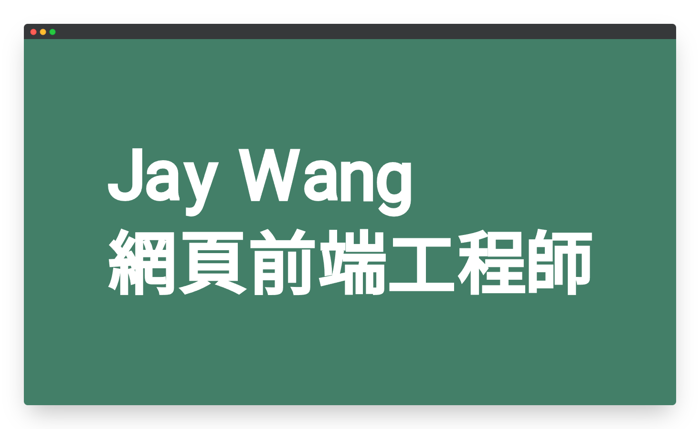

<!--
*** Thanks for checking out the Portfolio-Practice. If you have a suggestion
*** that would make this better, please fork the repo and create a pull request
*** or simply open an issue with the tag "enhancement".
*** Thanks again! Now go create something AMAZING! :D
***
*** To avoid retyping too much info. Do a search and replace for the following:
*** github_username (that is "windsuzu"), repo_name (that is "Portfolio-Practice"), project_title, project_description
-->

<!-- [![Issues][issues-shield]][issues-url] -->
<!-- [![PR Welcome][pr-welcome-shield]](#contributing) -->
[![Contributors][contributors-shield]][contributors-url]
[![MIT License][license-shield]][license-url]
[![Author][author-shield]][author-url]
[![LinkedIn][linkedin-shield]][linkedin-url]

<!-- PROJECT LOGO -->
 

  

  <h3 align="center">Portfolio Practice</h3>
  

    <a href="https://windsuzu.github.io/Portfolio-Practice">View Demo</a>
    ·
    <a href="https://github.com/windsuzu/Portfolio-Practice/issues">Report Bug</a>
  

Table of Contents

* [About](#about)
* [Preview](#preview)
  * [Web](#web)
  * [SmartPhone](#smartphone)
* [License](#license)
* [Contact](#contact)
* [Acknowledgements](#acknowledgements)

---

<!-- ABOUT THE PROJECT -->
## About

<table>
<tr>
<td>

**Portfolio Practice** 是一個使用 HTML5 + CSS3 + SCSS + 一點點 Javascript 來建立的練習用個人履歷網頁 (portfolio)。**Portfolio Practice** 的主要特色有:

- 網頁開頭動畫
  - [HTML](https://github.com/windsuzu/Portfolio-Practice/blob/main/index.html#L28-L258)
  - [JS](https://github.com/windsuzu/Portfolio-Practice/blob/main/app.js#L1-L7)
  - [SCSS](https://github.com/windsuzu/Portfolio-Practice/blob/c983e94c2a19a27907b12573d1a2df0128e4626d/styles/animation.scss)
  - [RWD - Media Query](https://github.com/windsuzu/Portfolio-Practice/blob/main/styles/animation.scss#L113-L135)
- 黏性導覽列、可移動至特定段落
  - [HTML](https://github.com/windsuzu/Portfolio-Practice/blob/main/index.html#L259-L284)
  - [SCSS](https://github.com/windsuzu/Portfolio-Practice/blob/main/styles/style.scss#L9-L56)
  - [RWD - Media Query](https://github.com/windsuzu/Portfolio-Practice/blob/main/styles/style.scss#L65-L83)
  - [JS](https://github.com/windsuzu/Portfolio-Practice/blob/main/app.js#L9-L35)
  - [Solve Header covering Problem](https://github.com/windsuzu/Portfolio-Practice/blob/main/styles/style.scss#L59-L63)
- 圖片造型設計
  - [HTML](https://github.com/windsuzu/Portfolio-Practice/blob/main/index.html#L305-L308)
  - [SCSS](https://github.com/windsuzu/Portfolio-Practice/blob/main/styles/introduction.scss#L24-L46)
  - [RWD - Media Query](https://github.com/windsuzu/Portfolio-Practice/blob/main/styles/introduction.scss#L49-L85)
- 表單設計 (Input, TextArea, Button)
  - [HTML](https://github.com/windsuzu/Portfolio-Practice/blob/main/index.html#L360-L384)
  - [SCSS](https://github.com/windsuzu/Portfolio-Practice/blob/main/styles/contact.scss#L14-L54)
  - [RWD - Media Query](https://github.com/windsuzu/Portfolio-Practice/blob/main/styles/contact.scss#L71-L96)

Built With:
- HTML 5
- CSS 3
- SCSS
- JavaScript

</td>
</tr>
</table>

---

## Preview

### Web

    
    
    
    

### SmartPhone

    
    
    
    
    
    

---

## License

Distributed under the MIT License. See [LICENSE](https://github.com/windsuzu/Portfolio-Practice/blob/main/LICENSE) for more information.

## Contact

Reach out to the maintainer at one of the following places:

* [GitHub discussions](https://github.com/windsuzu/Portfolio-Practice/discussions)
* The email which is located [in GitHub profile](https://github.com/windsuzu)

## Acknowledgements

* [Wilson Ren](https://www.udemy.com/user/wilson-r-6/)

[contributors-shield]: https://img.shields.io/github/contributors/windsuzu/Portfolio-Practice.svg?style=for-the-badge
[contributors-url]: https://github.com/windsuzu/Portfolio-Practice/graphs/contributors
[issues-shield]: https://img.shields.io/github/issues/windsuzu/Portfolio-Practice.svg?style=for-the-badge
[issues-url]: https://github.com/windsuzu/Portfolio-Practice/issues
[license-shield]: https://img.shields.io/github/license/windsuzu/Portfolio-Practice.svg?style=for-the-badge&label=license
[license-url]: https://github.com/windsuzu/Portfolio-Practice/blob/main/LICENSE
[linkedin-shield]: https://img.shields.io/badge/-LinkedIn-black.svg?style=for-the-badge&logo=linkedin&colorB=555
[linkedin-url]: https://linkedin.com/in/windsuzu
[pr-welcome-shield]: https://shields.io/badge/PRs-Welcome-ff69b4?style=for-the-badge
[author-shield]: https://shields.io/badge/Made_with_%E2%9D%A4_by-windsuzu-F4A92F?style=for-the-badge
[author-url]: https://github.com/windsuzu